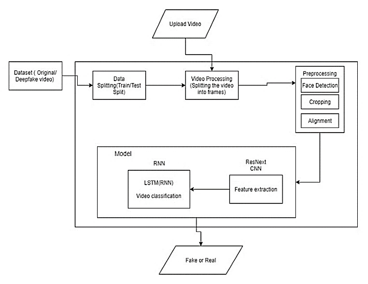
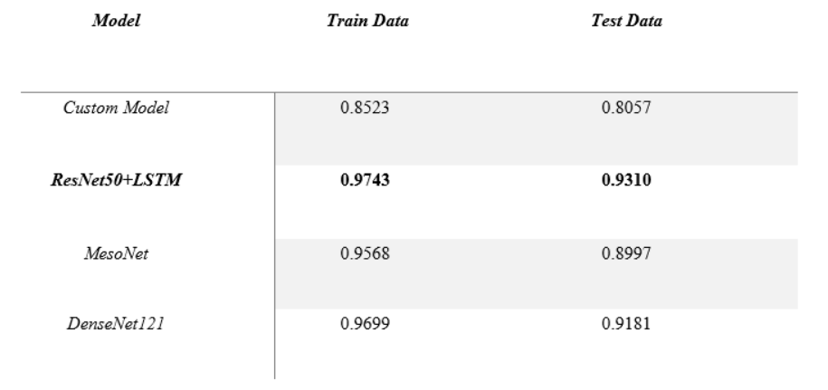

# Deepfake Video Detection (ResNet50+LSTM Model)

## Introduction
The aim of the project was to build a Deep Learning Binary Classifier to help detect deepfake videos which can be applied to solve several real world problems caused by deepfakes. In this work, we present our profound convolutional neural organization put together model approved with respect to [Deepfake Detection Challenge](https://kaggle.com/competitions/deepfake-detection-challenge/data) dataset for crucial AI research in deepfake discovery. We trained the dataset on various convolution neural network models like **ResNet50 + LSTM**, MesoNet, DenseNet-121 and custom models. Our best model of ResNet50 + LSTM has an accuracy score of **93.10%**. Through this project we are trying to automate the process of detecting deepfake videos. 

## Architecture

  

## Results

  

  

  

## Contributors
   1. [Astitva Shrestha](https://www.linkedin.com/in/astitva17a87/)
   2. [Navdeep Singh Hada](https://www.linkedin.com/in/navdeep-singh-hada-a102b7190/)
   